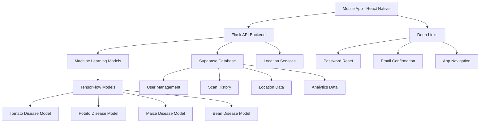

# 🌱 AgriSol - AI-Powered Plant Disease Detection System

[](https://opensource.org/licenses/MIT)
[](https://www.python.org/downloads/)
[](https://reactnative.dev/)
[](https://tensorflow.org/)

**AgriSol** is a comprehensive mobile application designed for agricultural disease detection and monitoring, specifically tailored for farmers in Rwanda. The system combines AI-powered plant disease detection with advanced location analytics, secure authentication, and administrative dashboard capabilities.

## 🎬 Demo Video

Watch AgriSol in action! See how farmers can easily detect plant diseases and get treatment recommendations:

[](https://drive.google.com/file/d/1akAciRDqzLp7KUPhfgRUxdEgjcnX5bvC/view?usp=drive_link)

**Demo Highlights:**

- 📱 Mobile app interface walkthrough
- 🔍 Real-time plant disease detection
- 📍 Location-based analytics
- 🔐 Secure authentication system
- 💼 Admin dashboard features
- 🌍 Multi-language support (English/Kinyarwanda/French)
- 🌙 Dark/Light theme support

## 📱 App Screenshots

### 🌱 Home & Navigation


_Main home screen with navigation and quick access to key features_

### 🔐 Authentication


_User login interface with secure authentication_


_User registration with comprehensive form_


_Multi-language support - Sign-up in Kinyarwanda_

### 🌱 Plant Disease Detection


_Crop type selection before scanning_


_Camera interface for capturing plant images_


_Disease detection results with treatment recommendations_

### 📊 History & Analytics


_Complete history of all plant scans and results_

### 🤖 User Experience


_Dark mode toggle for better user experience_


_User settings and preferences_


_Comprehensive crop care and treatment guide_

### 🤖 Admin Dashboard


_Administrative dashboard with analytics and user management_

## 📋 Table of Contents

- [🎯 Project Overview](#-project-overview)
- [✨ Key Features](#-key-features)
- [🆕 Recent Updates](#-recent-updates)
- [🏗️ Architecture](#️-architecture)
- [🚀 Quick Start](#-quick-start)
- [📱 Frontend Setup](#-frontend-setup)
- [🖥️ Backend Setup](#️-backend-setup)
- [🤖 Machine Learning Models](#-machine-learning-models)
- [💾 Database Setup](#-database-setup)
- [📊 Usage Guide](#-usage-guide)
- [🛠️ Development](#️-development)
- [🧪 Testing](#-testing)
- [📁 Project Structure](#-project-structure)
- [🔧 Technologies Used](#-technologies-used)
- [🤝 Contributing](#-contributing)
- [📄 License](#-license)

## 🎯 Project Overview

AgriSol addresses the critical need for early plant disease detection in Rwandan agriculture. The system empowers farmers with:

- **Real-time Disease Detection**: AI-powered analysis of plant images
- **Treatment Recommendations**: Comprehensive guidance for disease management
- **Location Analytics**: Geographic insights for disease patterns and trends
- **Multi-language Support**: Available in English, Kinyarwanda, and French
- **Secure Authentication**: Password reset, email confirmation, and account management
- **Administrative Dashboard**: Advanced analytics for agricultural authorities

### Supported Crops

- 🍅 **Tomatoes** (10 disease classes)
- 🥔 **Potatoes** (3 disease classes)
- 🌽 **Maize/Corn** (4 disease classes)
- 🫘 **Beans** (3 disease classes)

## ✨ Key Features

### 🔍 Disease Detection

- **Camera Integration**: Real-time plant scanning
- **Gallery Upload**: Analyze existing images
- **AI Analysis**: Advanced machine learning models with confidence scores
- **Treatment Guidance**: Immediate actions, organic alternatives, recovery estimates
- **Scan History**: Complete tracking of all user analyses

### 🔐 Authentication & Security

- **Secure Sign-up**: Email confirmation with auto-login
- **Password Reset**: Deep link integration for seamless recovery
- **Account Management**: Profile settings and account deletion
- **Multi-language Auth**: Login/signup in English, Kinyarwanda, French
- **Theme Support**: Dark/Light mode for all authentication screens

### 🗺️ Location Intelligence

- **Interactive Maps**: Real-time disease distribution visualization
- **Geographic Analytics**: Province, district, and sector-level insights
- **Risk Assessment**: Location-based disease risk scoring
- **Trend Analysis**: Historical disease pattern tracking
- **Theme-Aware UI**: Dropdowns and selectors adapt to dark/light themes

### 👥 User Management

- **Authentication System**: Secure login with role-based access
- **Profile Management**: User preferences and settings
- **Admin Dashboard**: Comprehensive analytics and user management
- **Multi-language**: English, Kinyarwanda, and French support
- **Account Deletion**: Secure account removal with data preservation

### 📊 Analytics Dashboard

- **Real-time Monitoring**: Live scan activity feeds
- **Location Leaderboards**: Performance metrics by region
- **Disease Trends**: Pattern analysis and alert systems
- **User Growth**: Engagement and adoption metrics
- **Responsive Design**: Mobile-optimized admin interface

## 🆕 Recent Updates

### ✅ **Authentication Enhancements**

- **Email Confirmation Flow**: Auto-login after email verification
- **Password Reset**: Deep link integration with app navigation
- **Account Deletion**: Multi-step confirmation with data preservation
- **Multi-language Auth**: Complete translation support for all auth screens

### ✅ **UI/UX Improvements**

- **Theme-Aware Dropdowns**: Fixed white background issues in dark theme
- **Responsive Admin Panels**: Mobile-optimized disease alert settings
- **Auto-close Modals**: Enhanced user experience with smart modal behavior
- **Placeholder Text**: Fixed missing placeholder text in authentication forms

### ✅ **Deep Link Integration**

- **Password Reset Links**: `agrisol://reset-password` deep link support
- **Email Confirmation**: `agrisol://confirm-email` auto-login flow
- **App Navigation**: Seamless transitions from email links to app screens

### ✅ **Data Preservation**

- **Account Deletion**: Scan history preserved when accounts are deleted
- **Anonymized Data**: User data anonymized rather than deleted
- **Admin Records**: Proper cleanup of admin user records

## 🏗️ Architecture



### Components

- **Frontend**: React Native mobile application with Expo
- **Backend**: Python Flask REST API with comprehensive ML integration
- **Database**: Supabase (PostgreSQL) for user data and analytics
- **ML Models**: TensorFlow-based disease detection models
- **Maps**: React Native Maps with clustering for location visualization
- **Authentication**: Supabase Auth with deep link integration

## 🚀 Quick Start

### Prerequisites

- **Node.js** 18+ with npm/yarn
- **Python** 3.11+
- **Git** for version control
- **Expo CLI** for mobile development
- **Supabase Account** (optional, for location features)

### 1. Clone the Repository

```bash
git clone https://github.com/davyleroy/Agri-sol.git
cd Agri-sol
```

### 2. Backend Setup (Required)

```bash
cd Backend
pip install -r requirements.txt
python run.py
```

The backend will start at `http://localhost:5000`

**🌐 Production Backend**: The backend is also deployed on Render and accessible at:
**https://agri-sol.onrender.com**

### 3. Frontend Setup

```bash
cd Frontend
npm install
npx expo start
```

### 4. Access the Application

- **Mobile**: Scan QR code with Expo Go app
- **Web**: Open browser at `http://localhost:8081`
- **API Documentation**:
  - Local: `http://localhost:5000/docs`
  - Production: `https://agri-sol.onrender.com/docs`
- **API Testing**:
  - Local: `http://localhost:5000/test`
  - Production: `https://agri-sol.onrender.com/test`

### Try AgriSol Now!

Want to test AgriSol immediately? Use the Expo Go app on your mobile device:

[](https://expo.dev/preview/update?message=Revert%20tensorflow%20version%20to%202.15.0%20in%20requirements.txt&updateRuntimeVersion=1.0.0&createdAt=2025-07-06T19%3A48%3A35.065Z&slug=exp&projectId=0f83e1d2-ed15-4dd4-8fb7-87f7ea7e0f25&group=f3a90702-e0c2-4e7d-898d-c1b5a5ab7c8b)

**How to use:**

1. Install [Expo Go](https://expo.dev/client) on your mobile device
2. Tap the link above or scan the QR code
3. 🌱 Start detecting plant diseases immediately!

_Note: The app requires the backend server to be running for full functionality. You can either run it locally or use the production backend at https://agri-sol.onrender.com. For a complete demo, follow the setup instructions above._

## 📱 Frontend Setup

### Installation

```bash
cd Frontend
npm install
```

### Environment Configuration

Create `.env` file (optional):

```env
# For local development
EXPO_PUBLIC_API_BASE_URL=http://localhost:5000

# For production (recommended)
EXPO_PUBLIC_API_BASE_URL=https://agri-sol.onrender.com

EXPO_PUBLIC_SUPABASE_URL=your_supabase_url
EXPO_PUBLIC_SUPABASE_ANON_KEY=your_supabase_key
```

### Running the App

```bash
# Start development server
npx expo start

# Run on iOS simulator
npx expo start --ios

# Run on Android emulator
npx expo start --android

# Run on web browser
npx expo start --web
```

### Building for Production

```bash
# Build for Android
npx expo build:android

# Build for iOS
npx expo build:ios
```

## 🖥️ Backend Setup

### Installation

```bash
cd Backend
pip install -r requirements.txt
```

### Environment Configuration (Optional)

Create `.env` file for enhanced features:

```env
# Optional - for location API
SUPABASE_URL=your_supabase_url
SUPABASE_SERVICE_KEY=your_service_key

# Optional - for production
SECRET_KEY=your_secret_key
FLASK_ENV=production
```

### Running the Server

```bash
# Development mode (recommended)
python run.py

# Direct execution
python app.py

# Production mode with Gunicorn
gunicorn --bind 0.0.0.0:5000 --workers 4 app:app
```

### Verify Installation

```bash
# Run system validation
python test_consolidated.py

# Run model validation
python diagnostics/model_validator.py

# Run comprehensive tests
python utils/testing_utils.py
```

### API Endpoints

- `GET /` - Health check and system status
- `GET /api/models` - Available models information
- `POST /api/ml/{crop_type}` - Disease prediction
- `GET /docs` - Swagger API documentation
- `GET /test` - Interactive web test interface

**🌐 Production API**: All endpoints are available at:
**https://agri-sol.onrender.com**

## 🤖 Machine Learning Models

### Model Architecture

The system uses TensorFlow-based Convolutional Neural Networks (CNNs) trained on crop-specific datasets:

- **Input Size**: 256×256×3 RGB images
- **Architecture**: Custom CNN with data augmentation
- **Training**: Transfer learning with fine-tuning
- **Optimization**: Multiple fallback strategies for reliability

### Available Models

```
Notebook/
├── tomato_disease_best_model_fixed.h5  # Tomato disease detection
├── potato_disease_model_best.keras     # Potato disease detection
├── bean_disease_model_best.keras       # Bean disease detection
└── corn_gentle_v3.h5                   # Maize disease detection
```

### Model Performance

- **Accuracy**: 85-95% across different crops
- **Inference Time**: <2 seconds per image
- **Confidence Scoring**: Probability-based with severity assessment
- **Fallback System**: Multiple model alternatives for reliability

### Adding Custom Models

1. Place model files in `Notebook/` directory
2. Update `Backend/config.py` with model paths
3. Add disease classes to configuration
4. Test with `python diagnostics/model_validator.py`

## 💾 Database Setup

### Supabase Configuration

1. **Create Supabase Project**: Visit [supabase.io](https://supabase.io)
2. **Get Credentials**: Note your project URL and service key
3. **Run SQL Scripts**: Execute files in `Frontend/Backend coms/`
4. **Update Environment**: Add credentials to `.env` files

### Database Schema

- **Users**: Authentication and profile management
- **Scans**: Disease detection history and results
- **Locations**: Rwanda administrative structure
- **Analytics**: Aggregated data for dashboard insights

### Optional Setup

The system works without Supabase - location features will be disabled gracefully if credentials are not provided.

## 📊 Usage Guide

### For Farmers

1. **Register/Login**: Create account or sign in
2. **Select Crop**: Choose the type of plant to analyze
3. **Capture Image**: Take photo or select from gallery
4. **Get Results**: View disease detection and treatment recommendations
5. **View History**: Access previous scans and results

### For Administrators

1. **Access Dashboard**: Login with admin credentials
2. **Monitor Activity**: View real-time scan activity
3. **Analyze Trends**: Examine disease patterns by location
4. **Track Users**: Monitor user growth and engagement
5. **Location Insights**: Use interactive maps for regional analysis

### API Usage

```python
import requests

# Health check (local)
response = requests.get('http://localhost:5000/')

# Health check (production)
response = requests.get('https://agri-sol.onrender.com/')

# Disease detection (local)
files = {'image': open('plant_image.jpg', 'rb')}
response = requests.post(
    'http://localhost:5000/api/ml/tomatoes',
    files=files
)
result = response.json()

# Disease detection (production)
files = {'image': open('plant_image.jpg', 'rb')}
response = requests.post(
    'https://agri-sol.onrender.com/api/ml/tomatoes',
    files=files
)
result = response.json()
```

## 🛠️ Development

### Code Structure

```
Agri-sol/
├── Frontend/           # React Native mobile app
├── Backend/            # Python Flask API
├── Notebook/           # ML models and training
├── Dataset/            # Training datasets
└── assets/             # Shared assets
```

### Development Workflow

1. **Backend First**: Start the API server
2. **Frontend Development**: Run mobile app with hot reload
3. **Testing**: Use built-in test interfaces
4. **Model Updates**: Retrain and deploy ML models
5. **Database Migrations**: Update Supabase schema as needed

### Code Quality

- **TypeScript**: Full type safety in Frontend
- **Python Type Hints**: Backend type annotations
- **ESLint/Prettier**: Frontend code formatting
- **Error Handling**: Comprehensive error management
- **Testing**: Unit and integration tests

## 🧪 Testing

### Backend Testing

```bash
cd Backend

# Quick system test
python test_consolidated.py

# Model validation
python diagnostics/model_validator.py

# API testing
python utils/testing_utils.py

# Comprehensive test suite
python run_all_tests.py
```

### Frontend Testing

```bash
cd Frontend

# Run tests
npm test

# Run tests with coverage
npm run test:coverage

# E2E testing
npm run test:e2e
```

### API Testing

- **Web Interface**: Visit `http://localhost:5000/test`
- **Swagger UI**: Visit `http://localhost:5000/docs`
- **Manual Testing**: Use provided test scripts

## 📁 Project Structure

```
Agri-sol/
├── Frontend/                          # Mobile Application
│   ├── app/                          # App screens and navigation
│   │   ├── (auth)/                   # Authentication screens
│   │   └── (tabs)/                   # Main app tabs
│   ├── components/                   # Reusable UI components
│   │   ├── admin/                   # Admin dashboard components
│   │   └── auth/                    # Authentication components
│   ├── contexts/                    # React contexts
│   ├── hooks/                       # Custom React hooks
│   ├── services/                    # API and external services
│   ├── types/                       # TypeScript type definitions
│   └── assets/                      # Images and static files
├── Backend/                          # API Server
│   ├── app.py                       # Main Flask application
│   ├── config.py                    # Configuration management
│   ├── run.py                       # Production startup script
│   ├── utils/                       # Utility functions
│   ├── diagnostics/                 # Model validation tools
│   └── legacy/                      # Backup of previous versions
├── Notebook/                         # Machine Learning
│   ├── *.keras                      # Trained model files
│   ├── *.h5                         # Alternative model formats
│   └── *.ipynb                      # Training notebooks
├── Dataset/                          # Training Data
│   ├── Tomato/                      # Tomato disease images
│   ├── Potato/                      # Potato disease images
│   ├── Bean_Dataset/                # Bean disease images
│   └── Maize(Corn)/                 # Maize disease images
└── assets/                          # Shared Assets
```

## 🔧 Technologies Used

### Frontend

- **React Native** 0.74+ - Cross-platform mobile development
- **Expo** - Development platform and tools
- **TypeScript** - Type-safe JavaScript
- **React Native Maps** - Map integration with clustering
- **Expo Camera** - Camera and image picker
- **AsyncStorage** - Local data persistence
- **Supabase Auth** - Authentication and user management

### Backend

- **Python** 3.11+ - Core programming language
- **Flask** 2.3+ - Web framework
- **TensorFlow** 2.15+ - Machine learning framework
- **NumPy/OpenCV** - Image processing
- **Flask-RESTx** - API documentation
- **Supabase** - Database and authentication

### Database & Infrastructure

- **Supabase** (PostgreSQL) - Primary database
- **AWS/Azure** - Cloud deployment options
- **Docker** - Containerization support
- **Gunicorn** - Production WSGI server

### Development Tools

- **Git** - Version control
- **ESLint/Prettier** - Code formatting
- **Jest** - Testing framework
- **Expo CLI** - Mobile development tools

## 🤝 Contributing

We welcome contributions to AgriSol! Please follow these guidelines:

### Getting Started

1. Fork the repository
2. Create a feature branch: `git checkout -b feature/amazing-feature`
3. Make your changes
4. Run tests: `npm test` (Frontend) and `python -m pytest` (Backend)
5. Commit changes: `git commit -m 'Add amazing feature'`
6. Push to branch: `git push origin feature/amazing-feature`
7. Open a Pull Request

### Development Guidelines

- Follow existing code style and conventions
- Add tests for new features
- Update documentation as needed
- Ensure all tests pass before submitting
- Use descriptive commit messages

### Bug Reports

- Use GitHub Issues for bug reports
- Include steps to reproduce
- Provide system information
- Add screenshots if applicable

## 📄 License

This project is licensed under the MIT License - see the [LICENSE](LICENSE) file for details.

## 🙏 Acknowledgments

- **Rwanda Ministry of Agriculture** - Domain expertise and requirements
- **Farmers** - User feedback and testing
- **Open Source Community** - Libraries and frameworks used
- **TensorFlow Team** - Machine learning framework
- **Expo Team** - Mobile development platform

## 📞 Support

- **Documentation**: Check the guides in each component directory
- **Issues**: Use GitHub Issues for bug reports and feature requests
- **Email**: Contact the development team for urgent issues
- **Community**: Join our discussions and contribute to the project

---

**Made with ❤️ for Rwandan farmers and agricultural communities**

Repository: https://github.com/davyleroy/Agri-sol.git
